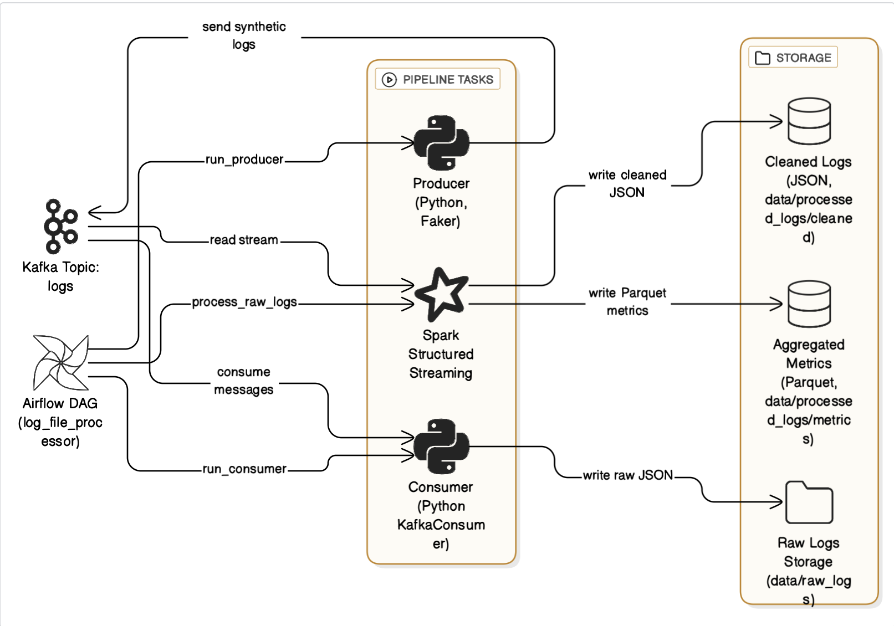
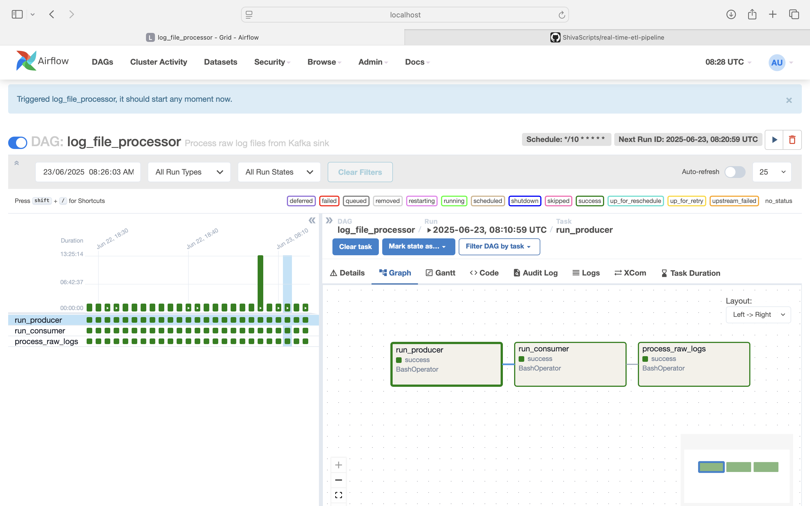
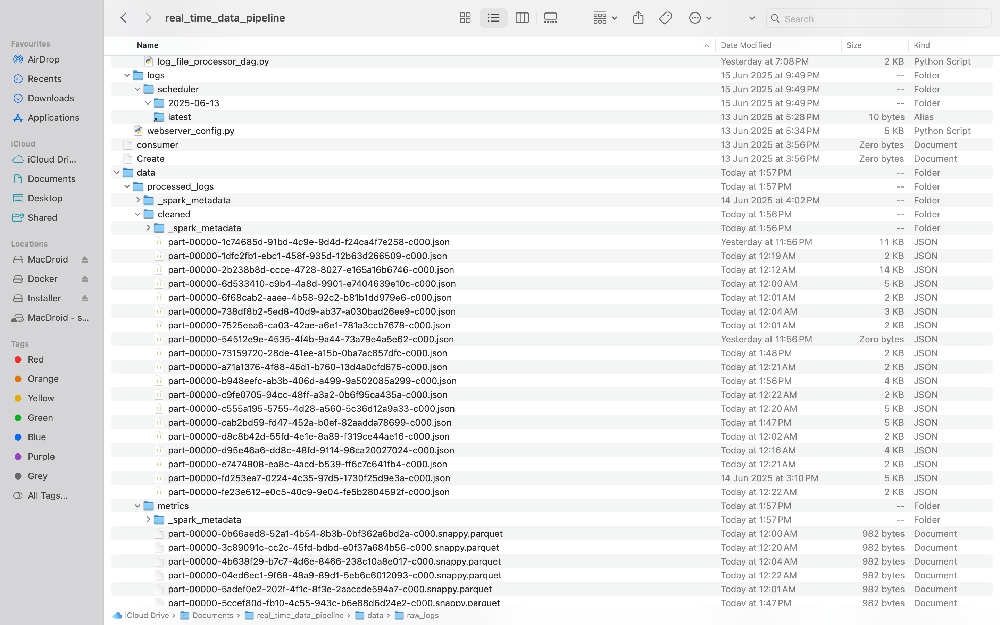
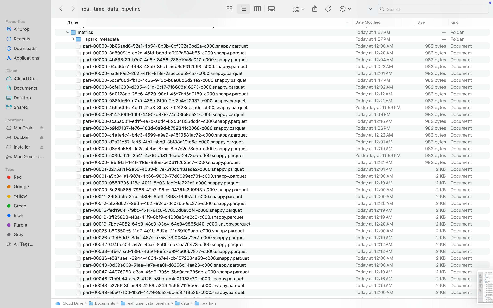
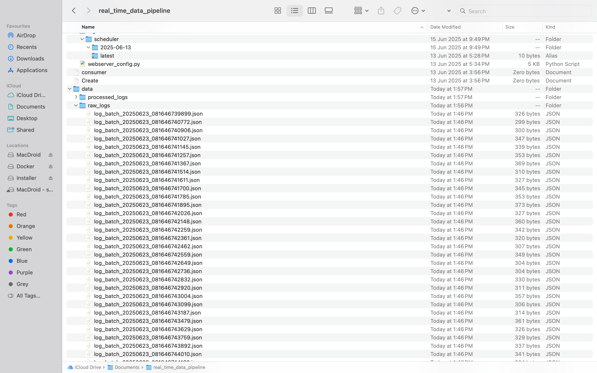

# 🟥 Real‑Time ETL Pipeline  
*A real‑time ETL pipeline leveraging Kafka, Spark, Airflow, and Docker containers.*  

---

## 📋 Summary  
This pipeline automatically generates example log messages, sends them through Kafka, saves the raw logs, cleans and analyzes them with Spark, and is scheduled and monitored by Airflow.
- 🔄 **Streaming Ingestion:** Apache Kafka ingests synthetic logs in real time.  
- 🤖 **Data Generation:** Python `Faker` library creates realistic fake log entries.  
- ⚡ **Stream Processing:** Spark Structured Streaming transforms and aggregates logs.  
- 📆 **Workflow Orchestration:** Airflow schedules & monitors your ETL DAG.  
- 🐳 **Containerized Deployment:** Docker Compose spins up Kafka, Spark, Airflow, etc.

---
## Architecture Diagram

---

## Demo / Screenshots

Below are key screenshots demonstrating the pipeline in action.

### 1. Airflow DAG Running

*Airflow UI showing the `log_file_processor` DAG with tasks `run_producer`, `run_consumer`, and `process_raw_logs` all succeeding.*

---

### 2. Cleaned Data by Spark

*Directory listing of cleaned JSON output under `data/processed_logs/cleaned`, produced by the Spark Structured Streaming job.*

---

### 3. Aggregated Metrics by Spark

*Directory listing of Parquet files under `data/processed_logs/metrics`, containing the 1-minute window aggregations.*

---

### 4. Raw Logs Stored

*Directory listing of raw JSON log batches under `data/raw_logs`, showing files created by the Kafka consumer.*

---

## ✨ Features  
- **Real-Time Data Ingestion** via Kafka topics  
- **Synthetic Log Generation** with `Faker`  
- **Fault-Tolerant Stream Processing** using Spark (exactly-once semantics)  
- **DAG-Based Scheduling** through Airflow  
- **One‑Click Deployment** with Docker Compose  

---

## 🛠 Tech Stack  
- **Kafka** – Distributed streaming platform  
- **Spark Structured Streaming** – Scalable, fault-tolerant stream processing  
- **Airflow** – Workflow orchestration and scheduling  
- **Docker & Docker Compose** – Containerization and multi-service orchestration  
- **Python** – Core language for scripts  
- **Faker** – Synthetic data generation library  

---
## 🔮 Future Work

Below are potential enhancements and next steps to evolve this real-time log processing pipeline:

- **Schema Management**:  
  Integrate a schema registry (e.g., Confluent Schema Registry) and use Avro/Protobuf for log messages to support safe schema evolution and efficient parsing.

- **Monitoring & Alerting**:  
  Expose metrics (e.g., consumer lag, Spark throughput, error counts) to Prometheus/Grafana; set up alerts for anomalies such as spikes in error rates or slow response times.

- **Data Sink Extensions**:  
  Extend outputs to external systems:  
  - Write cleaned data and aggregated metrics to data warehouses (e.g., Snowflake, BigQuery) or object storage (e.g., S3) for analytics and archival.  
  - Optionally feed real-time dashboards (e.g., Elasticsearch/Kibana or a BI tool).

- **Anomaly Detection / ML**:  
  Incorporate ML-based anomaly detection on logs or metrics (using Spark ML or external services). Trigger alerts or automated remediation workflows when anomalies are detected.

- **Scalability & Resilience**:  
  - Deploy on Kubernetes or cloud-managed platforms (e.g., Kafka MSK, Spark on Kubernetes/EMR, Airflow via Helm/Astronomer).  
  - Implement dynamic scaling, backpressure handling, retries, and dead-letter queues for malformed or problematic log entries.

- **Security Enhancements**:  
  Secure Kafka with TLS/SASL, encrypt data at rest and in transit, and enforce access controls for Airflow, storage, and data consumers.

- **Testing & CI/CD**:  
  - Add unit/integration tests for producer/consumer logic, using mocks or Testcontainers for Kafka.  
  - Automate build, test, and deployment via CI pipelines (e.g., GitHub Actions), including linting and versioning.

- **Configuration Management**:  
  Externalize configurations (via environment variables, config files, or secret managers), and support multiple environments (dev/staging/prod) with parameterized settings.

- **Flexible Topology**:  
  Support multiple topics or dynamic subscriptions, allowing parallel pipelines for different log sources or services.

- **Data Quality Checks**:  
  Integrate data validation (e.g., Deequ or custom Spark checks) before writing downstream; report data quality metrics and handle bad records appropriately.

- **User Interface / Dashboard**:  
  Provide a lightweight UI or integrate with existing dashboards to visualize pipeline health, recent raw/cleaned data samples, and metric trends. Link to Airflow and Spark UIs.

- **Cost & Resource Optimization**:  
  Profile and optimize Spark configurations for performance and cost; implement retention policies and cleanup for raw/processed data.

- **Documentation & Examples**:  
  - Add detailed examples for customization and extension.  
  - Include sample log schemas and example entries.  
  - Maintain changelog or release notes for enhancements.

